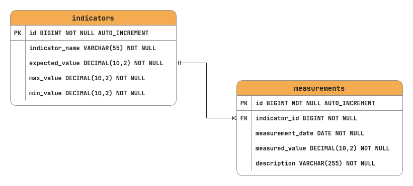

# Prueba Técnica Desarrollador de Software Equinorte.

La siguiente prueba técnica fue realizada por el Ing. Juan Camilo Arrieta Bernal.

## Contenido
- [Base de Datos](#base-de-datos)
- [Backend](#backend)
- [Frontend](#frontend)


## Base de datos

Se ha usado MySQL como gestor de base de datos para almacenar y gestionar la información de la aplicación.

### Requisitos previos:

- MySQL Server: Tener instalado y en funcionamiento.
- En el archivo [indicator_db.sql](./indicator_db.sql) se encuentra el script de la base de datos, puede importarlo desde su gestor de base de datos o copiar y pegar el script y luego ejecutarlo. Tener en cuenta que tambien se encuentra el SQL de la consulta pedida en la **ENTREGA 1**
- Imagen del modelo relacional:




## Backend

El backend ha sido desarrollado con Java 17 y Spring Boot. Este componente se encarga de gestionar las solicitudes y respuestas de la aplicación, así como de la interacción con la base de datos.

### Instalación de Dependencias

1. Requisitos previos

- Java Development Kit (JDK): Versión 17.
- Apache Maven: Para la gestión de dependencias y la construcción del proyecto. Tambien se puede usar los gestores de Maven que contienen cada uno de los IDE de la Java: Intellij IDEA (Usado), Netbeans, Eclipse.

2. Pasos para la instalación

- Clona el repositorio
    ```bash
    git clone https://github.com/Bernieta/PruebaTecnicaEquinorte

    # Acceder al directorio del proyecto y abrirlo en su IDE
    cd Backend/
    ```
- Luego puede abrir el proyecto en su IDE de preferencia.
- Configure la conexión a la base de datos desde el archivo *application.properties*
    ```bash
    spring.datasource.url=jdbc:mysql://localhost:3306/indicator_db
    spring.datasource.username=userExample
    spring.datasource.password=passwordExample.
    spring.datasource.driver-class-name=com.mysql.cj.jdbc.Driver
    ```

## Frontend

El frontend ha sido desarrollado con Angular 17.3.9. Esta aplicación proporciona una interfaz de usuario que contiene una tabla para la gestion de los indicadores. Además por cada indicador se pueden ver sus historiales de medidas desde el boton **Medidas**.

### Instalación de Dependencias

1. Requisitos previos:
- **Node.js:** Asegúrate de tener la última versión de Node.js instalada.
- **Angular CLI:** Es recomendable tener la Angular Command Line Interface instalada para facilitar el desarrollo.

2. Pasos para la instalación:

- Clona el repositorio del frontend:
    ```bash
    git clone https://github.com/Bernieta/PruebaTecnicaEquinorte

    # Acceder al directorio del proyecto 
    cd Frontend/

    # Instalar dependencias
    npm install

    # Ejecutar
    ng serve

    ```
- A continuación abra el navegador e ingresa http://localhost:4200 para interactuar con la aplicación.
- La aplicación está organizada en componentes que representan diferentes partes de la interfaz de usuario.
Utiliza servicios para manejar la comunicación con la API del backend, permitiendo la obtención y el envío de datos de manera eficiente.
